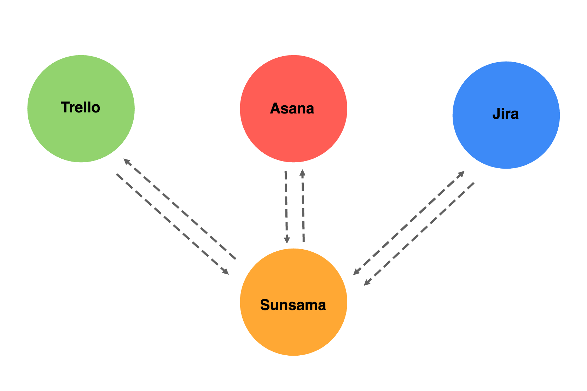

### General Approach
**Task 1: Read over the documentation**
##### Trello
- General process:
  - Connect to library.
  - Authenticate user (OAuth).
  - Find a list ID (tricky part, they don't go to in depth about this).
  - Update a Card in Trello when Task is updated in Sunsama (e.g. `Trello.put('/cards/[ID], {name: 'New Test Card'}')`)
  - Update a Task in Sunsama when a Card is updated in Trello (via a [webhook](https://developers.trello.com/apis/webhooks))
    - "Whenever a change on the model occurs, we will send an HTTP POST request to the provided endpoint"


##### Asana
- General process:
  - Register application.
  - Authenticate user (OAuth)

  - Update a Task in Sunsama when an Event is updtaed in Asana (via a [webhook](https://asana.com/developers/api-reference/webhooks))
  - Webhooks are a way to receive [Events](https://asana.com/developers/api-reference/events) via HTTP POST at the time they occur instead of polling for them.


##### Jira


**Task 2: Get on the same page**
- User creates a Task on Sunsama.
- User can export that Task to Trello, Asana, and/or Jira (one at a time).
- When a User updates a Task on Sunsama, its Asana, Trello, and/or Jira counterparts should update as well.
- When a User updates a Task on Asana, Trello, and/or Jira, the Task should update on Sunsama as well.
- (?) What if Task is updated on Asana? Task should update in Sunsama, however, does this trigger updates in Trello and Jira?
  - (?) Infinite looping: if Asana triggers an update in Sunsama, this may trigger an update in Asana again. How to prevent infinite looping?


**Task 3: Block Diagram (sketch) of this feature**


**Task 4: Sketch out data-model**
- ```javascript
  sampleTask={
    _id: 1,
    title: "Title",
    description: "Some description."
  }
  ```
- ```javascript
  function exportAsanaTask {

  }
  ```
- ```javascript
  function exportTrelloTask {

  }
  ```
- ```javascript
  function exportJiraTask {

  }
  ```

**Task 5: Identify Issues**
- Collisions
  - What happens when two people edit a calendar event at the same time?
- Scalability
  - High Read Load:
    - Master Slave Replication
  - High Write Load:
    - Sharding: one router with diff database buckets
      - e.g. having all users a-f in one database bucket, f-g in one bucket, etc.
      - e.g. geographic already
      - natural aggregation of data for Sunsama
        - likely by company
        - teams work in the same place
        - little interaction between companies in terms of scheduling, more internal
  - How to make it faster? Caching & CDN.
    - What can be cached? Common queries, static data, etc.
      - All users (that way don't have to hit database)
      - Common queries (personal calendar)
      - Cache everything that hits db if possible b/c queries are expensive
      - Cache invalidation --> LRU Cache
